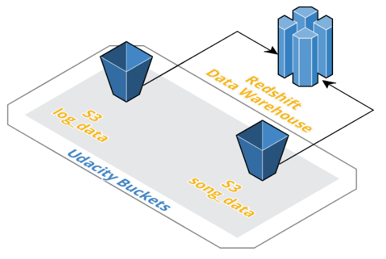
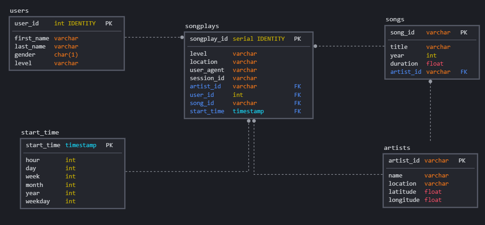

## Discussion

### Project Purpose

The Sparkify company has grown in the last years and they need move their process and data into a cloud structure. The purpose of this project is build a pipeline to extracts data from json files on Amazon S3 and transform them in dimensional tables for Sparkify's analytics team.

### Extraction

All events and songs data are located on S3 buckets. So, it was created an ETL process that responsible for extract the data from the buckets and load them into Redshift tables. 

### Staging Tables

There are two staging tables, one for each type of data on S3. The staging tables **staging_songs** and **staging_events** has the purpose to store the data that will be prepared and loaded into final database schema.

### Database Schema

The project was built based on the star architecture. There are 4 dimension tables: **users** **, ** **songs**, **artistis ** and **time **, the 4 tables refer to the entities of our business model, there is also a fact table called **songplays ** that allows a performatic queries, without the use of JOINs. **Songplays** table contains the data of a specific song played, its user and artist.

## Project structure

### Files 

- **create_tables.py**: This script is responsible for run create table queries and drop table queries defined at **sql_queries.py**;
- **sql_queries.py**: This file is responsible for define queries to create, drop, insert and copy data into databases;
- **etl.py**: This script is responsible for run copy and insert queries defined at **sql_queries.py**;
- **dwh.cfg**: This file stores the AWS connection configurations.

### ETL Process

The data is loaded into two staging tables. After that, one query for each dimension and fact table is executed, the query will transform the staging tables  data and insert them into their respective tables for the analytics team.

### How To Run

To run the project, follow the steps: 

- Create Redshift Cluster and modify the dwh.cfg file to your cluster variables;
- Run **create_tables.py** to create the staging, dimension and fact tables.
- Run **etl.py** to copy the data from S3 buckets to Redshift staging tables and insert the data from staging tables to dimension and fact tables thought ETL process.
